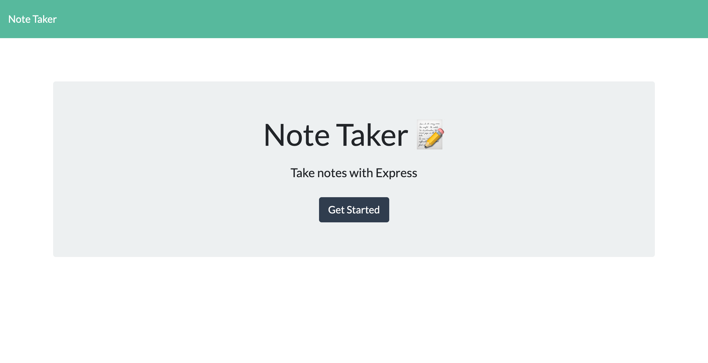
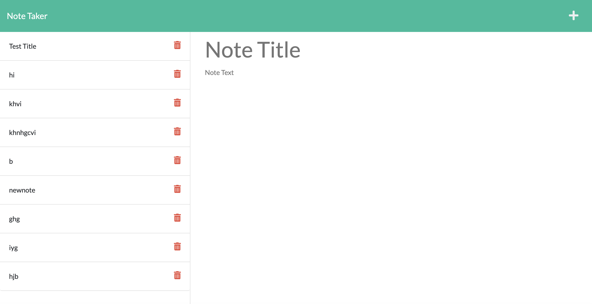
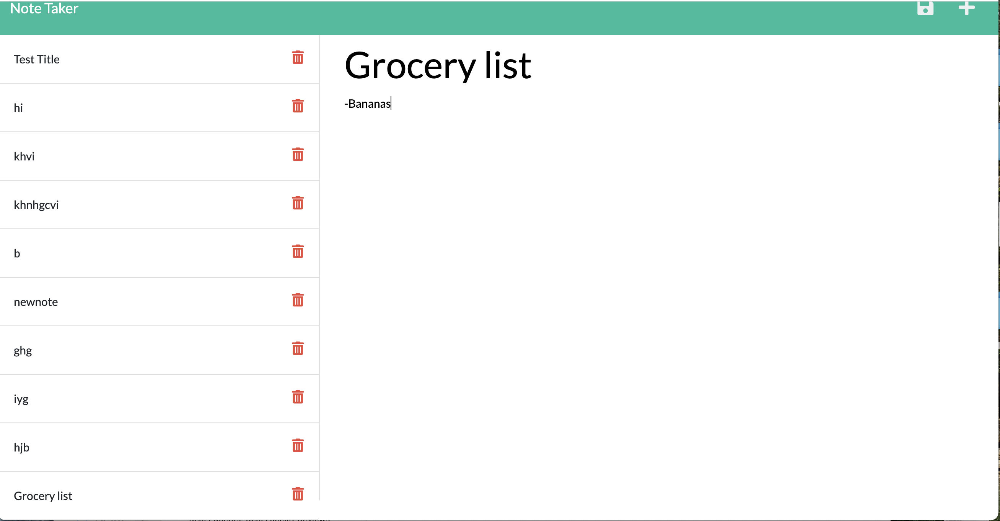

# Note Taker

## Description

The note taker is an application used to write and save notes. 
This application will use Express.js back end and will save and retrieve note data from a JSON file.

## Table of Contents 

- [Screenshots](#screenshots)
- [Installation](#installation)
- [Technologies used](#technologies-used)
- [Deployed link](#deployed-link)
- [Author](#author)

## Screenshots

## Installation

Install my project with node package manager 

`git clone git@github.com:KaterynaTekmenzhi/note-action.git`
`cd ~/note-action`
`npm install`

To deploy this project

`node server.js`

You'll be able to see the application deployed on http://localhost:3001

## Technologies used

Node.js, Express.js, HTML, CSS, Heroku
## Deployed link 

https://rocky-castle-16680.herokuapp.com/

## Author

https://github.com/KaterynaTekmenzhi/note-action
